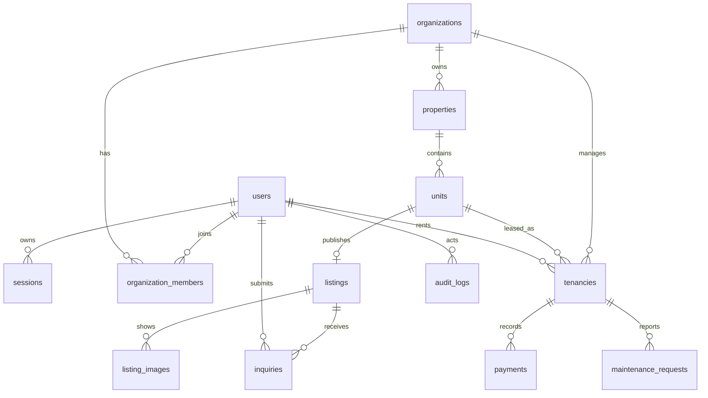

# Data model

All primary keys are UUIDs. Money uses `numeric(12,2)` in PostgreSQL and is serialized as decimal-compatible JSON numbers. Ownership is derived through `organization_members`; mutation bodies do not accept authoritative organization or owner identifiers. Partial uniqueness prevents more than one active tenancy for a unit. Check constraints enforce all P0 enums and valid monetary/date ranges.
