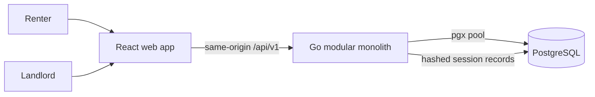

# System context

FindYourKeja is the public marketplace and renter experience. PropFlow is the landlord operations experience. The browser never talks directly to PostgreSQL or an AI/payment provider. Server middleware authenticates the opaque session cookie and derives the user's role and organization membership before domain handlers run.

## Runtime topology

- Development: Vite on `:5173` proxies `/api` to Go on `:8080`; PostgreSQL listens on `:5432`.
- Docker demo: Nginx serves the frontend on `:5173`, proxies to the API container, and PostgreSQL stays on the internal Compose network (with a development host port).
- Tests: a separately named `propflow_test` database is required for destructive integration setup.
